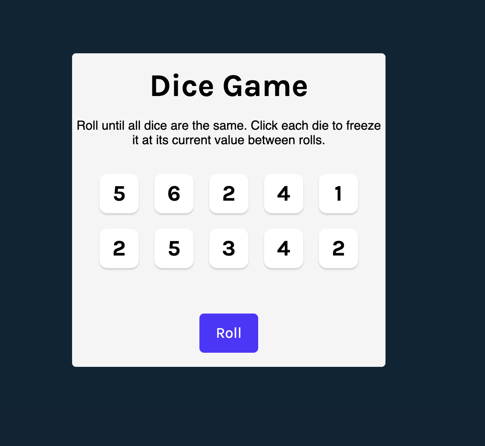

## Dice Game 
A simple React-based dice game inspired by Tenzies built using **React JS and Vite.**

Roll until all dice show the same value. Click each die to freeze it at its current value between rolls.

The goal of this project is to practice React JS.


[ Let's Try in Live :)](https://gmarav05.github.io/dice-game/)

## Video

https://github.com/user-attachments/assets/5b88f3a1-d96b-468f-8cf2-c8b57cf6ac8d


## Image


#

## Features

- Built with React and Vite.

- It uses Confetti animation on win using `react-confetti`.

- The game has Accessibility features (uses aria-labels)  and keyboard-friendly.

- Deployable to GitHub Pages.

## Learnings

- Learned how to use React JS Hooks like `useState`, `useEffect`, `useRef`.

- Practiced building Component-based architecture.

- Practiced some CSS Flexbox styling.

- Practiced more CSS flexbox.


## Live demo

[ View Live  :)](https://gmarav05.github.io/dice-game/)

## Technology Stack

 **Frontend:** HTML5 + CSS + React JS.

 **Build Tool:** Vite.

 **Deployment:** GitHub Pages.

 **Dependencies:** react-confetti, nanoid.


## Project Structure

```
dice-game/

├── dist/                 # Production build
├── public/               # Public assets
├── src/
│   ├── App.jsx           # Main game logic and state management
│   ├── Die.jsx           # Individual die component
│   ├── index.css         # Global styles
│   ├── main.jsx          # Application entry point
│   └── assets/           # Static assets (images, icons)
├── index.html            # HTML template
├── package.json          # Project dependencies and scripts
├── README.md             # Project documentation
└── vite.config.js        # Vite configuration
```

## Getting Started

### Install dependencies


```sh
npm install
```

### Run locally

```sh
npm run dev
```

### Build for production

```sh
npm run build
```

### Deploy to GitHub Pages

```sh
npm run deploy
```


---

 
